## 46. Consuming With ConsumerGroups—Create Producer

### What we will create

* Consumer with a consumer group
* Producer: publish comodity data
* Functionalities 
  * 1: Update dashboard
  * 2: Send notidication 
* Read the same message, different functionality

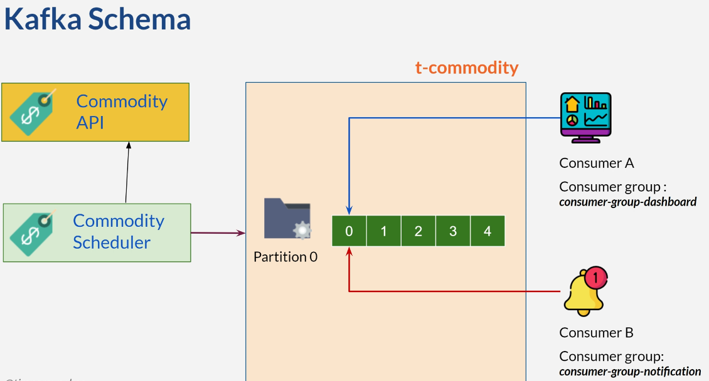
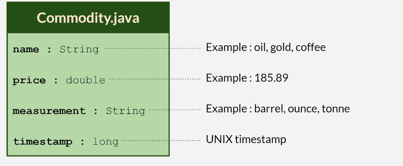


### Consumer Group & Offset

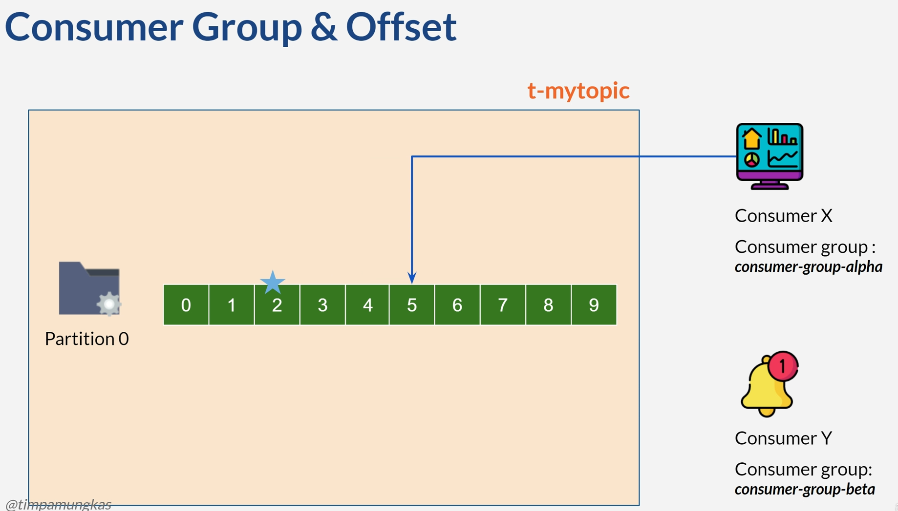
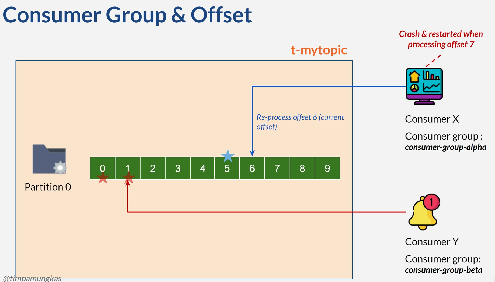


### Retention Period
* Consumer expected to read sequentially
* Possible bug that causes consumer down 
* Kafka default retention period is 7 days 
  * Offset is invalid since data no longer exists after 7 days
* Set retention period using borker config:
  * **offset.retention.minutes**

### Auto Offset Reset

* New consumer group ID behavior is determined from Spring Kafka
  - **spring.kafka.consumer.auto-offset-reset**: 
    - **earliest**
    - **latest** (default value)
    - **none**

### Lag & Manual Offset Reset

* Difference between the latest message vs message a consumer group has processed 
* How to calculate
* Monitoring & identity potential bottlenecks
* Bigger lag meaning

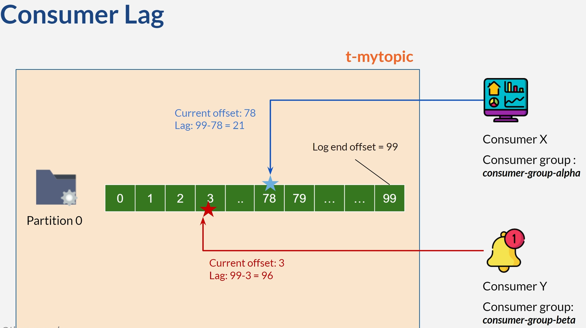


### Replay data

* Replay data: reprocessing previously consumed messages
* Use cases:
  * Correcting errors
  * Data recovery 
  * Historical analysis
  * Testing
* Reset consumer offset to earlier position
* Consume from the resetted offset onwards


### Commiting Offsets

* Set on application.yaml, key 
  * **spring.kafka.enable.auto.commit**
    * **true**: auto commit according to broker configuration
    * **false**: set mode manually
* Default value for Spring Boot 3 is false
  * Set on application.yaml, key:
    * **spring.kafka.listener.ack-mode**
      * **record** → commit the offset when the listener returns after processing the record
      * **batch** (default value) → commit the offset when all the records in the poll() have been processed. 
      * **time** → commit the offset when all the records returned by the poll() have been processed, as long as the **ackTime** since the last commit has been exceeded.
      * **count** → commit the offset when all the records returned by the pool() have been processed, as long as **ackCount** records have been received since the last commit.
      * **count_time** → similar to **time and count**, the commit is performed if either condition is true.
      * **manual** → the message listener must explicitly commit offsets after processing messages.
      * **manual_immediate** → in this mode, the acknowledgment is immediately followed by a commitment of the offsets to Kafka, ensuring that the offsets are committed right after 
      each message is processed
* See Spring Kafka official documentation


### Configuring Kafka From Spring 
* Kafka provides many customizable configurations
* For usage, see the official Kafka documentation
* Link in the last section of the course 
* Configuration usage out of the course scope
* Learn how to set the value from Spring 


### Kafka Cluster

* Kafka for data communication backbone
* For learning / development : single Kafka broker
* Kafka cluster: multiple brokers work as unity
* At least 3 brokers for production

### Replication 

* Copy data from one broker to another 
* Data redundancy benefit
* Increase replication factor(2,3, ...)
* Data will be copied as much as a replication factor
* If a broker is down, other broker will still have the copy of data

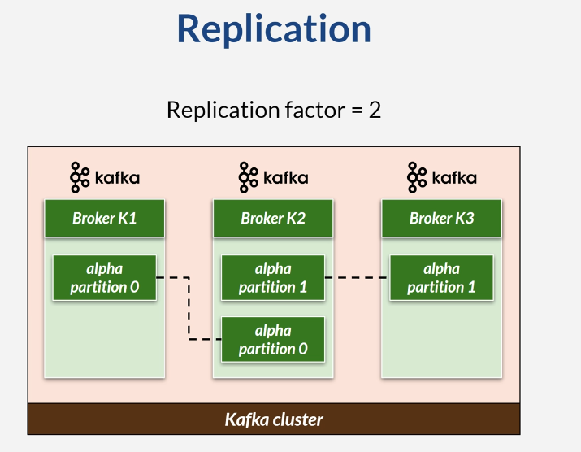

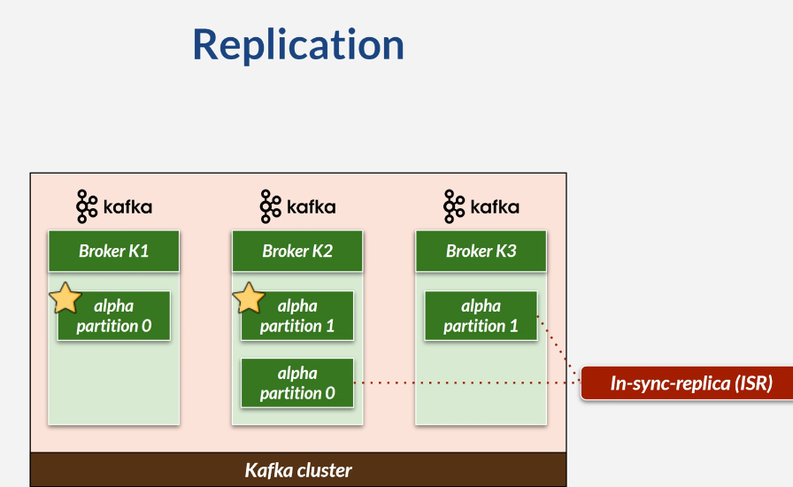

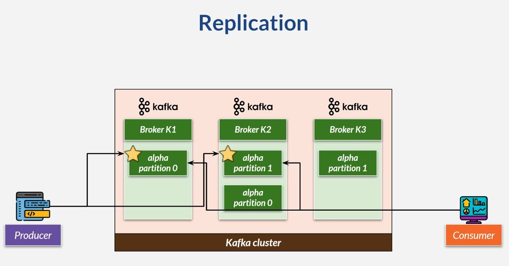


## Set Replication Factor on Topic

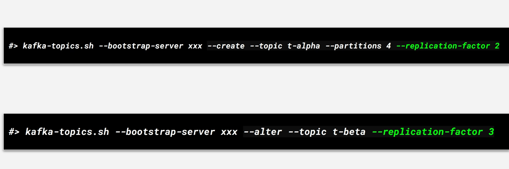


## Consumer Replica Fetching

* Kafka 2.4 or newer
* Broker setting
  * rack.id = XYZ
  * replica.selector.class
* Consumer setting
  * client.rack = XYZ

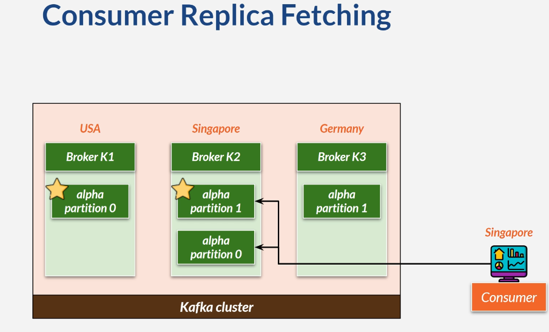


## Producer Acknowledgment (Ack)

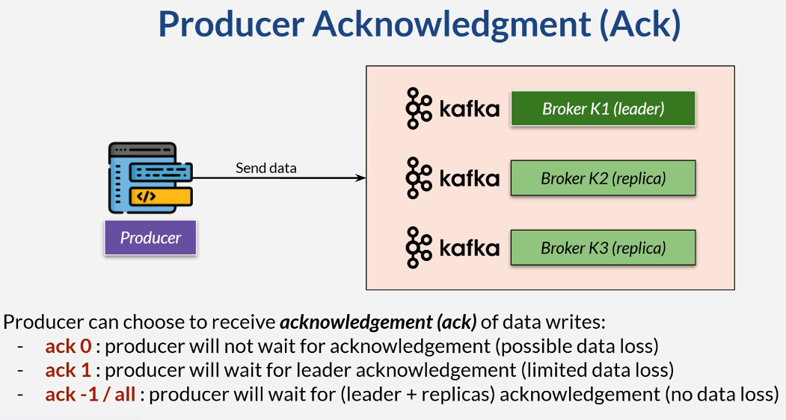

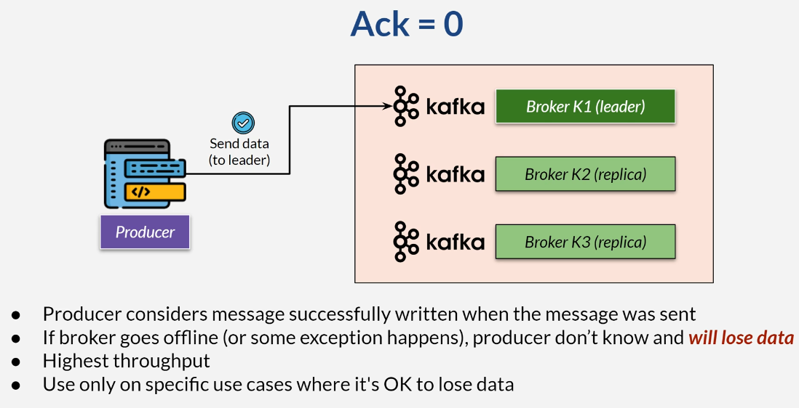

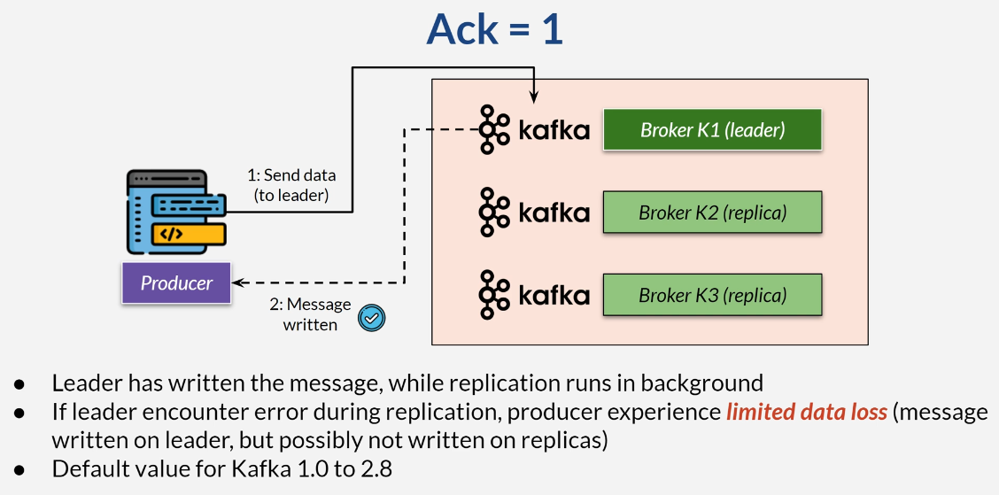

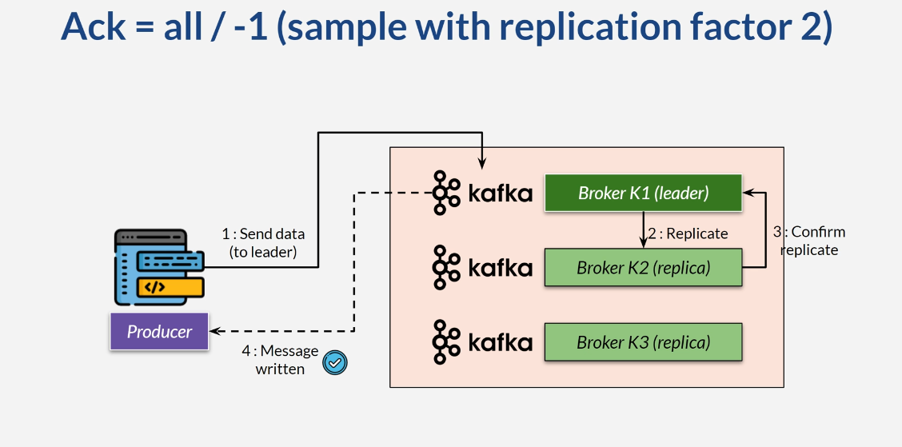

### min.insync.replicas 
 * Use **acks = all** in conjunction with min.insync.replicas
   * In broker or per topic 
 * Are there enough in-sync replicas to write safely? 

### Topic Durability

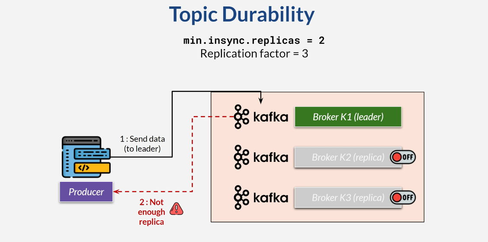

* Recommendation: at least 3 replica factors and 2 min.insync.replica
* At least one replica gets the data
* Reject rather than risk losing data
* Producer waits for replicas to be available

### Set Producer Ack
```yaml
spring:
  kafka:
    producer:
      acks: 0 / 1 / -1 / all
```

### Set min.insync.replicas on Topic

```shell
#> kafka-topics.sh --create --bootstrap-server xxx:9092 --topic t-beta --replication-factor 3 --partitions 3 
--config min.insync.replicas=2
```

```shell
#> kafka-configs.sh --bootstrap-server xxx:9092  --alter --entity-type topics  --entity-name t-beta
--add-config min.insync.replicas=3
```