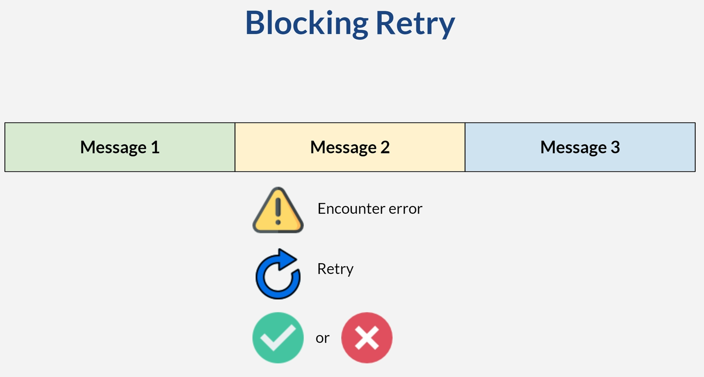

# Consumer with Retry

* Spring Kafka will log failed messages (default behaviour)
* We can build our own error handler
* Case
  * Service temporarily unavailable
  * Retry hit service without a trigger from the consumer
  * Retry for N times only 

## Scenario
* Topic: t-image, 2 partitions
* Publish message represents image
* Consumer 
  * Simulate API call to convert image
  * Simulate failed API call
  * Retry after 10 seconds
  * Retry 3 times

# Blocking Retry

* Good when message must be processed in sequence
* Drawback: process halted (might bottleneck)
* Mitigation: retry "just enough"
* Block only on partition which has error
* Other partition (no error) keep consuming