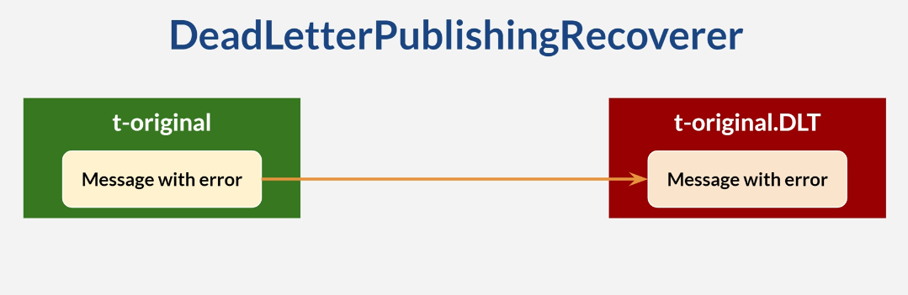
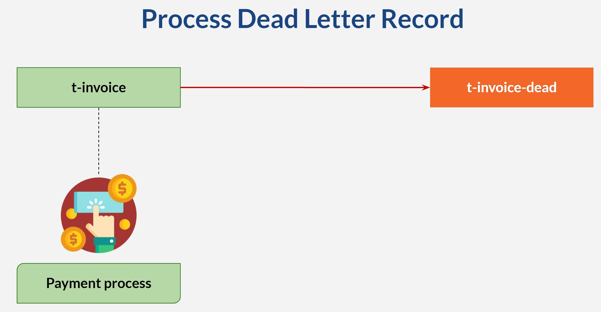

# Dead Letter Topic

* Message process keep failing
  * Non-technical issue
  * Permanent technical issue
  * Process message differently 
* Send such message to dead letter topic
* Dead letter Record

# Scenario
* Publish to t-invoice
* If amount is less than one, throw exception
* Retry 5 times
* After 4 failed retry attempts, publish to t-invoice-dead
* Another consumer will consume from t-invoice-dead

# Dead Letter Records

* Dead Letter record: messages sent to DLT
* Just regular topic/ message
* Create consumer to listen from DLT

