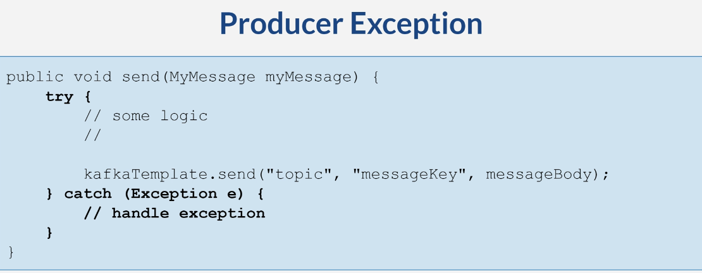

## @KafkaListener Error Handler

# What We Will Do 

* Spring default: log exception
* Able to implement our own error handler
* Scenario 
  * Publish food order

# Error Handler
* Implement custom logic
* Need error handler
* Use the error handler on @KafkaListener