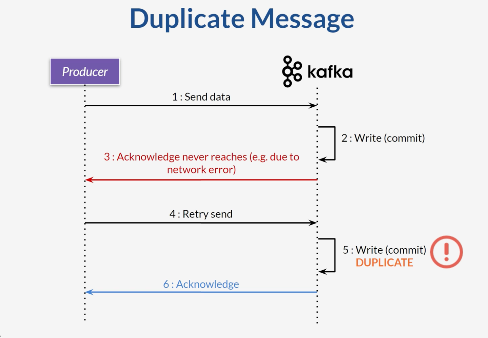
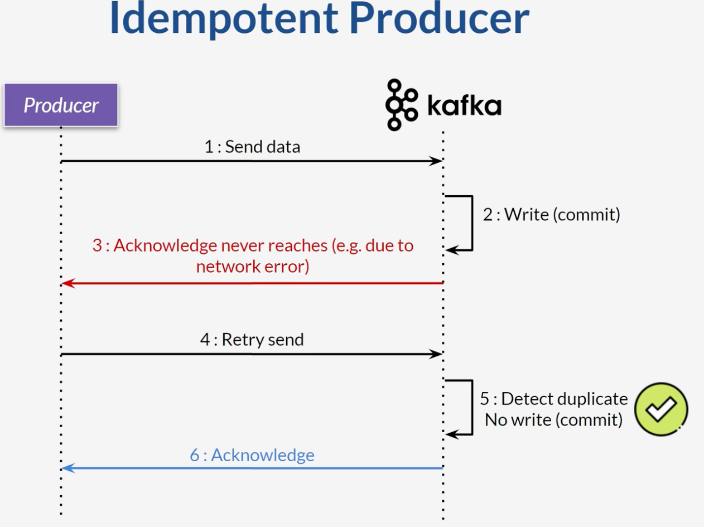

# Idempotent Producer
* Use idempotent producer
* Guarantee deduplicates messages (eliminate duplicates)
* Important where message duplication can cause issue
* Set **enable.idempotence=true**
* Kafka will use this configuration 
  * **retries = 2147483647**
  * **max.in.flight.requests.per.connection = 5**
  * **acks = all**
* Simplify producer logic

