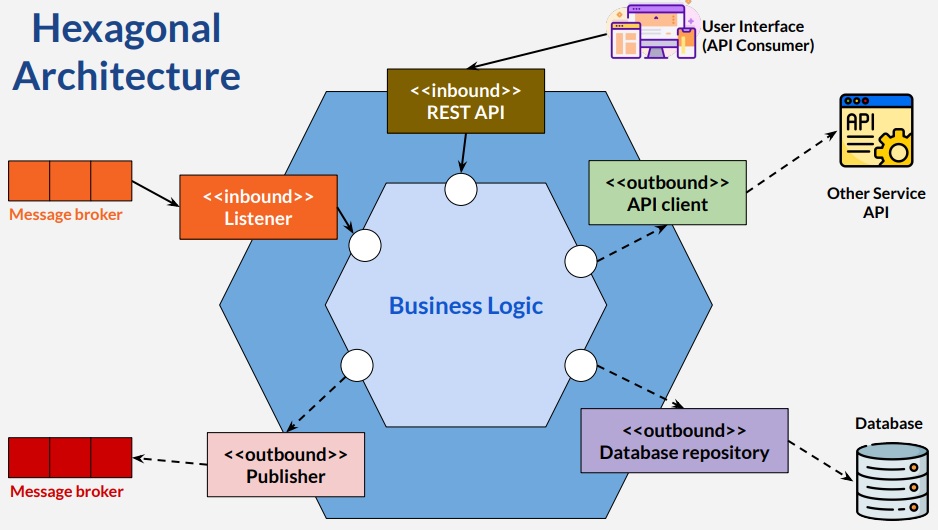
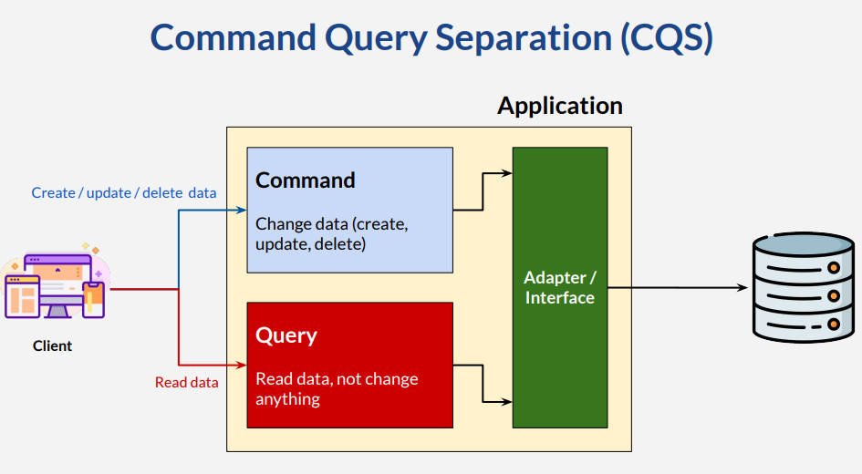
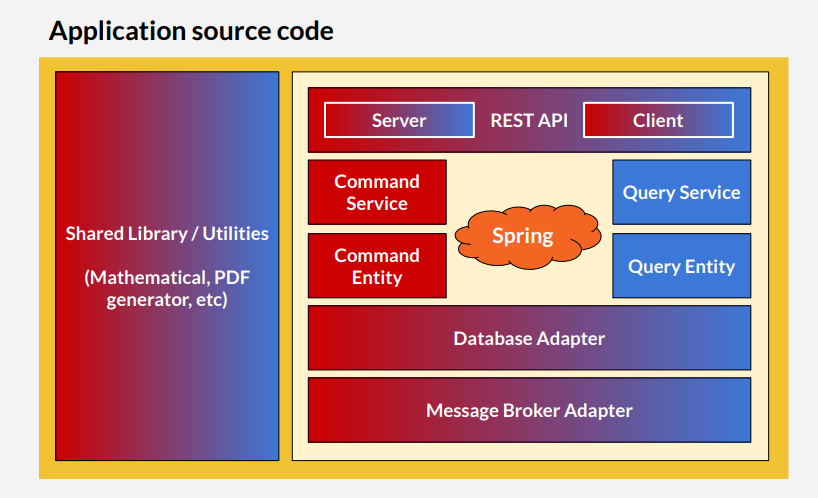

# The Need of Organizing
* Many codebase
* Applications
  * Easy to work with
  * Easy future changes
* Easy transfer knowledge & employee onboarding
* Multiple coding & source code organizations
* Patterns for code structure & organization

## Hexagonal Architecture
* Benefit: decouple business logic with data access
* Easier to test or change
* Communication using multiple adapters

## Command Query Separation

* Command / transaction / modifier / mutator
* Query / view
* Separate, don't mix
* Easier maintenance and change

