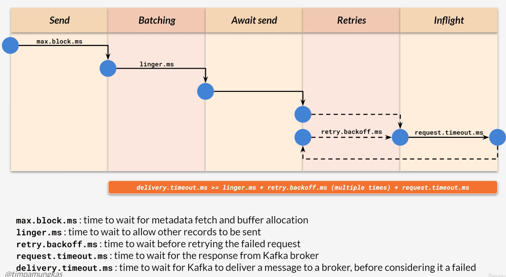

# Producer Retry

* Encounter transient (temporary) errors
* Handle by setting producer retry config
* Retry for transient errors does not involve programming
* Non-transient, e.g. invalid message format, unavailable broker, generally handled on application code

# Setting Producer Retry Config

* Configure **spring.kafka.producer.retries** to more than 0 
* Default value is more than zero (producer retry enabled by default)
* Configure **retry.backoff.ms** to set the delay between retries, default value is 100ms

# Out-of-Order on Retry
 
* Messages sent during retries may out of order 
* Possible causes
* Could be an issue  
* Use idempotent producer to handle this

