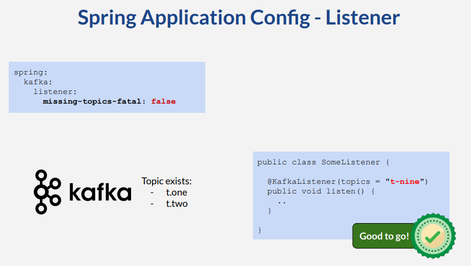
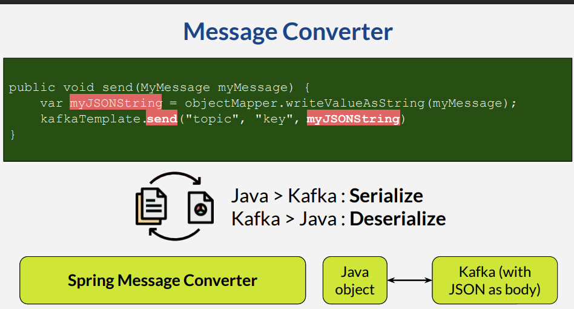
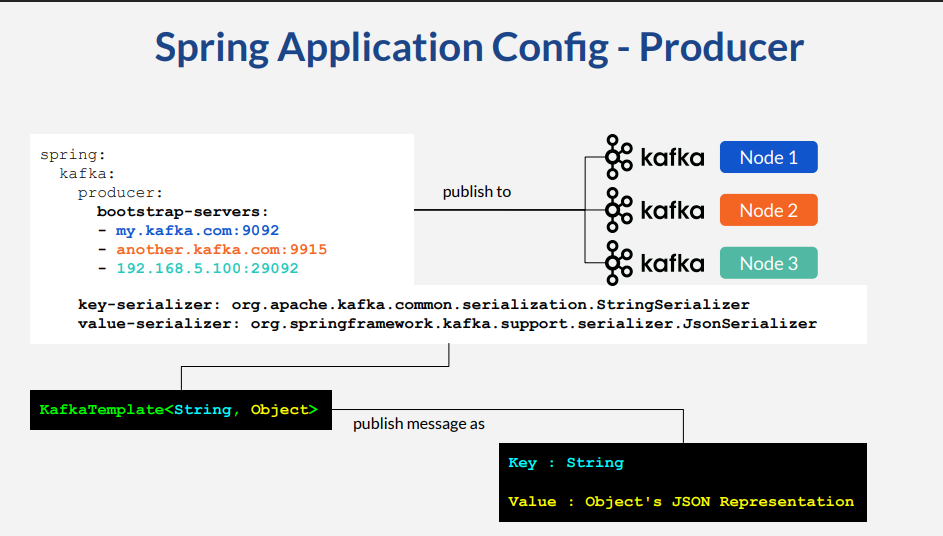
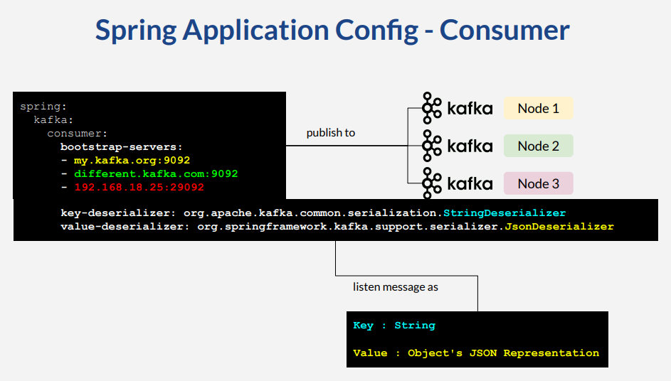
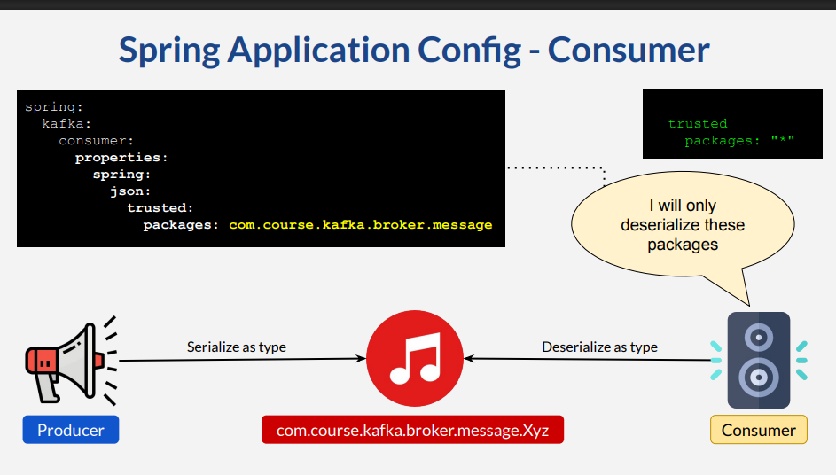
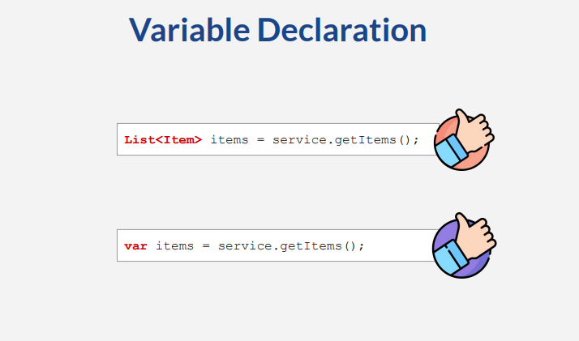

# Setting Up The Projects

## Spring Initializr

* Generate 4 java / gradle projects from start.spring.io
  * Group : **com.course.kafka**
  * Artifact : **kafka-ms-order**, **kafka-ms-pattern,
  kafka-ms-reward, kafka-ms-storage**
  * Package name : **com.course.kafka** (remove any
  suffix)
* Spring boot 3.x + Java 21

## Dependencies

* kafka-ms-order
  * Web 
  * Spring kafka
  * JPA
  * H2 database
* Other 3 projects
  * Spring kafka

