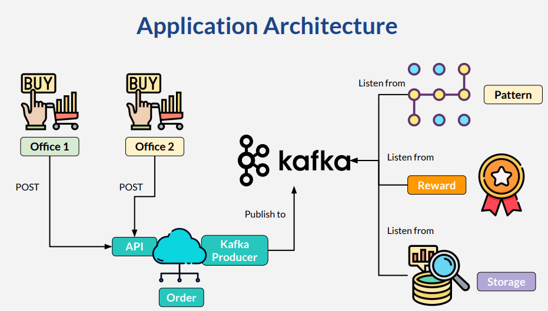

# What We Will Build

## Application Overview

* Oversimplified application
* Introducing possible kafka usage on real life
* Microservice architecture & pattern
* Microservice reference on last lesson

## Use Case

* Commodity trading company with multiple
branches
* Branch submit purchase order to head office
* After process :
* Pattern analysis
* Reward
* Big data storage
* Speed is the key
* Branch office submit each order once
* Head office process using kafka

## App In The Course
* Use postman to simulate API call
* In memory H2 database
* Data gone every restart
* Database is not focus
* Algorithm & source code structure

## Microservices & Client

* Spring Boot
  * Kafka Order : port 9001
  * Kafka Pattern
  * Kafka Reward
  * Kafka Storage
* Client
  * Postman : download from **postman.com**