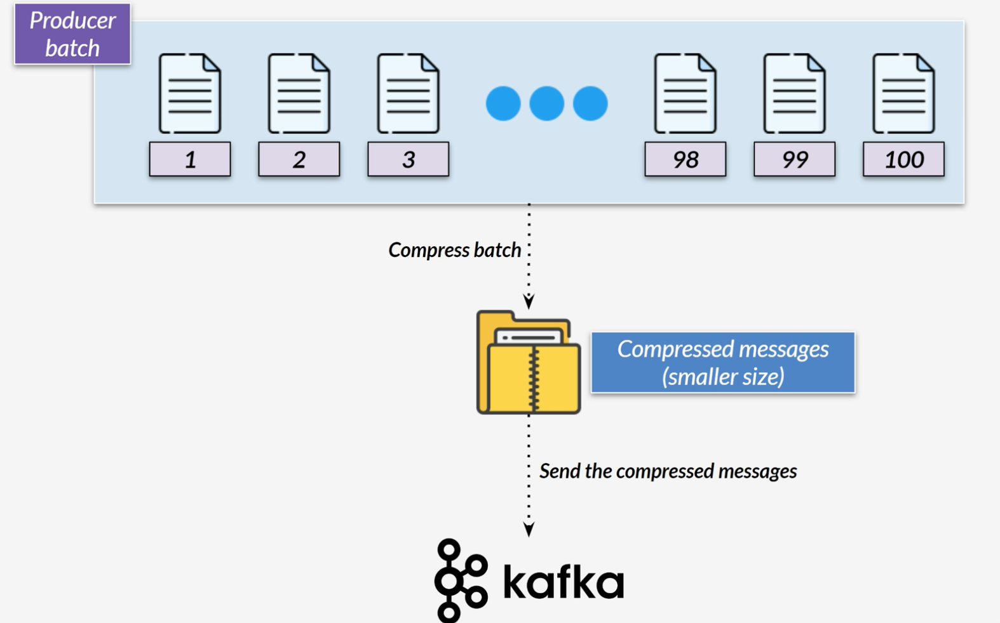
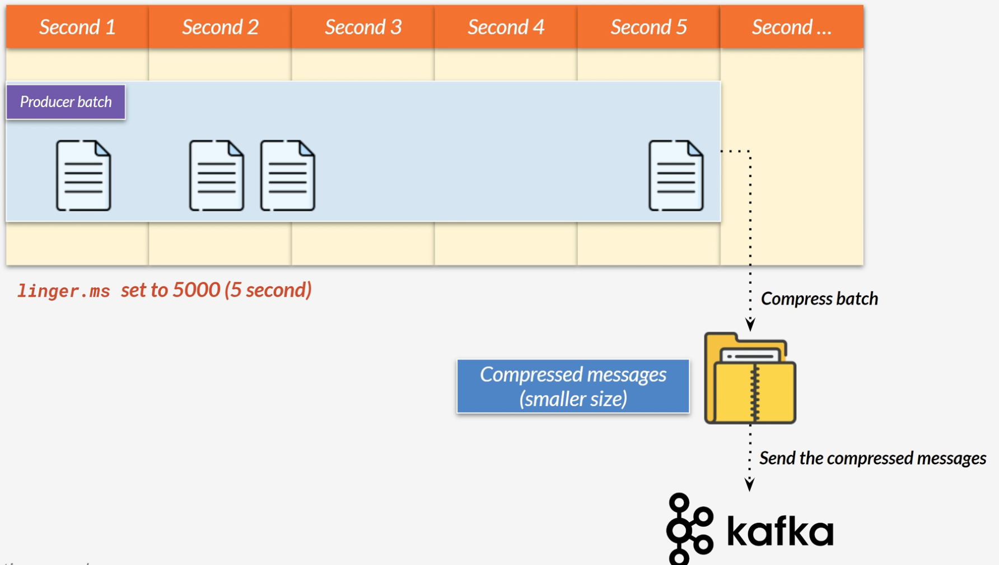

# Message Compression

* Reduce the size of messages before transmitted
* Improve overall system performance
* Configurable in produce or consumer
* Available compression types: none, zstd, gzip, snappy, lz4

* Advantages:
    * Smaller request (up to 4 times smaller)
    * Faster transmission, better disk utilization
* Disadvantages:
    * Additional CPU cycles on the producer
    * Additional CPU cycles on the consumer
* Small disadvantages compared to advantages

* On Spring, set key
  * **spring.kafka.producer.compression-type**
* Broker's default value is producer 
  * Take a compressed batch as is from a producer
  * Producer needs to configure the compression (easily done on Spring)

## Kafka Batch 
* Further tweak: linger millisecond & batch size 
* Default behavior: send message as soon as possible
* Batching increase throughput with the low latency 
* Further benefit with compression (higher compression ratio)

# Linger ms & Batch Size

* **linger.ms** : how long to send a batch of messages
  * Default: 0 (immediately send messages)
* **batch.size** : maximum batch size (bytes) before start sending (if linger has not been elapsed)
  * Increase batch size for larger bytes size per batch 

# Batch size  

* Maximum batch size for each byte
  * Default: 16384 (16KB)
* Increasing batch size leads to efficiency  
* Message bigger than batch size will not be batched 
* Set batch size to 0 to turn off batching
* Set on Spring property: **spring.kafka.producer.batch-size**

# Summary

* Increase linger millisecond to make the producer wait for the batches to fill up 
  * Delay sending, use it with careful 
* Increase batch size to send a larger batch 