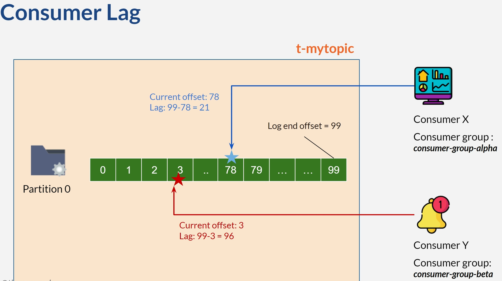

# Consumer Group & Offset

### Retention Period
* Consumer expected to read sequentially
* Possible bug that causes consumer down
* Kafka default retention period is 7 days
    * Offset is invalid since data no longer exists after 7 days
* Set retention period using borker config:
    * **offset.retention.minutes**

### Auto Offset Reset

* New consumer group ID behavior is determined from Spring Kafka
    - **spring.kafka.consumer.auto-offset-reset**:
        - **earliest**
        - **latest** (default value)
        - **none**

### Lag & Manual Offset Reset

* Difference between the latest message vs message a consumer group has processed
* How to calculate
* Monitoring & identity potential bottlenecks
* Bigger lag meaning

### Replay data

* Replay data: reprocessing previously consumed messages
* Use cases:
    * Correcting errors
    * Data recovery
    * Historical analysis
    * Testing
* Reset consumer offset to earlier position
* Consume from the resetted offset onwards

### Commiting Offsets

* Set on application.yaml, key
    * **spring.kafka.enable.auto.commit**
        * **true**: auto commit according to broker configuration
        * **false**: set mode manually
* Default value for Spring Boot 3 is false
    * Set on application.yaml, key:
        * **spring.kafka.listener.ack-mode**
            * **record** → commit the offset when the listener returns after processing the record
            * **batch** (default value) → commit the offset when all the records in the poll() have been processed.
            * **time** → commit the offset when all the records returned by the poll() have been processed, as long as the **ackTime** since the last commit has been exceeded.
            * **count** → commit the offset when all the records returned by the pool() have been processed, as long as **ackCount** records have been received since the last commit.
            * **count_time** → similar to **time and count**, the commit is performed if either condition is true.
            * **manual** → the message listener must explicitly commit offsets after processing messages.
            * **manual_immediate** → in this mode, the acknowledgment is immediately followed by a commitment of the offsets to Kafka, ensuring that the offsets are committed right after
              each message is processed
* See Spring Kafka official documentation