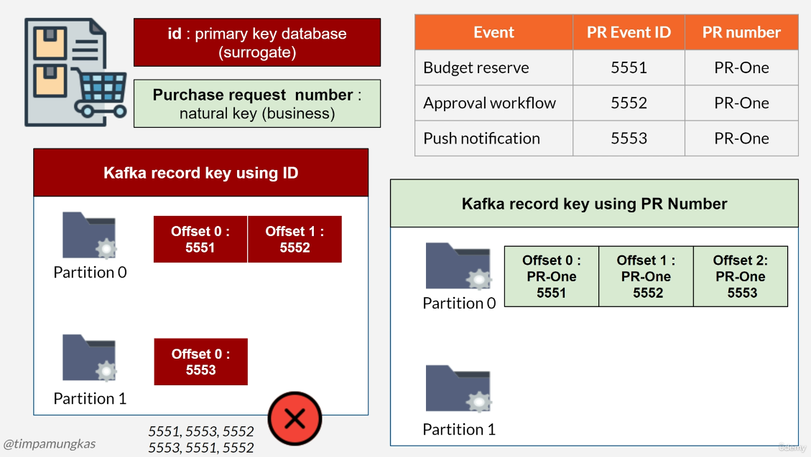

<h2 style="color: lightgreen;">Idempotency (Handle Duplicate Messages)</h2>

## At-Least-Once Delivery Semantic

* Message guaranteed to be published
* Message might be published more than once
* Consumer processes all messages (including duplicate ones)
* Possibilities for duplicate messages

## Idempotent Consumer
* Duplicate message is OK
  * The outcome of processing a message is always the same even for duplicate messages
  * Example: update search engine index
* Duplicate message is dangerous: 
  * Duplicate transaction
  * Example: create (duplicate) payment
  * Filter out duplicate messages

## Gray Area 
* It might be dangerous, or not 
* Example: send promotion email to user
* Can either OK, or bad user experience
* Technically should filter out duplicate messages
* Double output is not idempotent

# How to Deduplicate?
* Unique value attached to each message
* Consumer check unique value when receive record
  * Never processed > store unique value, then process the message
  * Has been processed > skip message
* Use database for permanent unique value 
* Use cache for temporary unique value 
* Cache 
  * Better performance
  * Automatically remove data certain time
  * Example: Redis
* Database 
  * Might publish duplicate after a longer period
  * Virtually unlimited storage
* Our example will use cache 

# No Unique Value 
* No unique value on a message
* Alternative: use object as unique value
  * Bad idea, if the object contains large data
  * Eat up cache memory / slow database
* Derive key from a combination of fields
  * Combination must be unique
* <h4 style="color: red">Don't use java hashCode()</h2>
  * Not guaranteed to be unique for a different object
