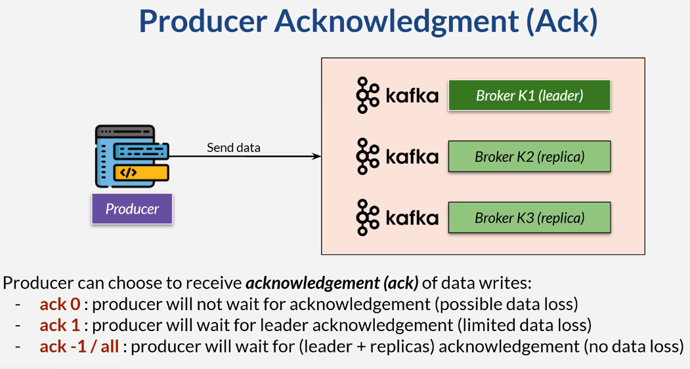
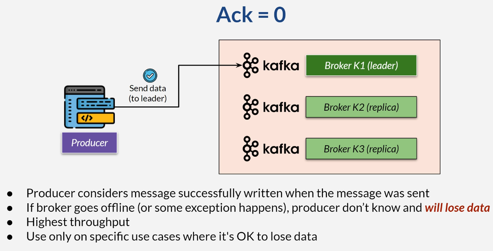
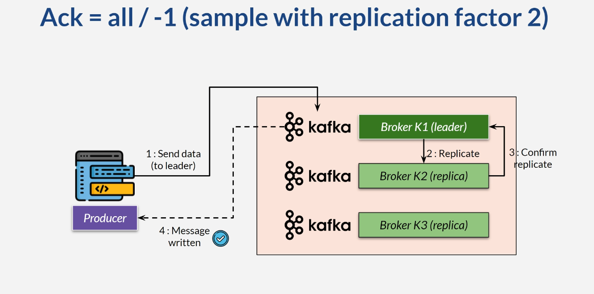
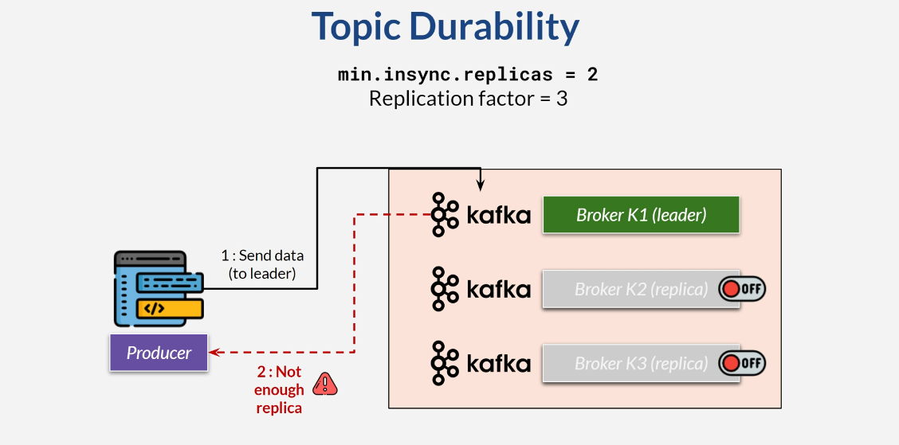

## Producer Acknowledgment (Ack)








### min.insync.replicas
* Use **acks = all** in conjunction with min.insync.replicas
    * In broker or per topic
* Are there enough in-sync replicas to write safely?

### Topic Durability



* Recommendation: at least 3 replica factors and 2 min.insync.replica
* At least one replica gets the data
* Reject rather than risk losing data
* Producer waits for replicas to be available

## Set Producer Ack
```yaml
spring:
  kafka:
    producer:
      acks: 0 / 1 / -1 / all
```

### Set min.insync.replicas on Topic

```shell
#> kafka-topics.sh --create --bootstrap-server xxx:9092 --topic t-beta --replication-factor 3 --partitions 3 
--config min.insync.replicas=2
```

```shell
#> kafka-configs.sh --bootstrap-server xxx:9092  --alter --entity-type topics  --entity-name t-beta
--add-config min.insync.replicas=3
```