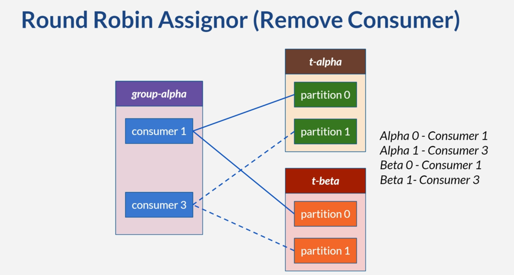

# Rebalancing

* Rebalancing: redistributing partitions across comsumers
* Triggers:
    * Consumer joining or leaving a particular consumer group
    * Partition count on topic changes
* Impact:
    * Temporary unavailability
    * Resource overhead

# Illustration
* Set a partition assignment strategy
* Next examples:
    * 2 topics
    * 2 partitions each topic
    * 3 consumers, each listen to the 2 topics

# Rebalance
* Eager: range, round-robin, sticky
    * A period where consumers stop
    * More consumers means more time to rebalancing
* Cooperative: cooperative-sticky
    * Like sticky assignor
    * Consumers can keep consuming during rebalance
* Default strategy in Kafka 3: [range, cooperative-sticky]

# Static Group Membership
* Influence rebalance behavior
* By default, consumer receives new member ID (consumer ID) when leave & rejoin the group
* Specify group instance ID
* Example static ID scenario
* Useful when stability of consumer group memberships is important
* Facilitate local cache
* When to use static group membership?

# Kafka Metadata Refresh

* Delay time before rebalancing occurs
* Changes in Kafka metadata are cached
* Configurable on parameter metadata.max.age.ms
    * Default is 300000 (5 minutes)
* Adjusting parameter value can be useful
    * **Shorter value**: faster cache update, but has resource overhead
    * **Longer value**: slower cache update, but reduce resource overhead 
