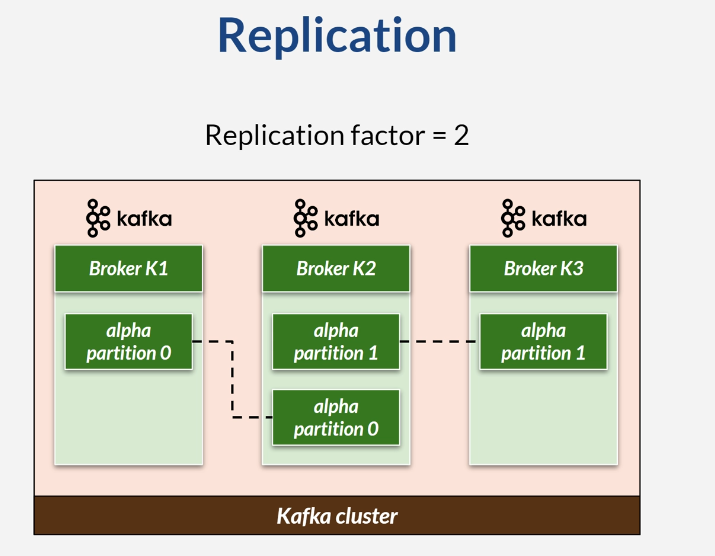
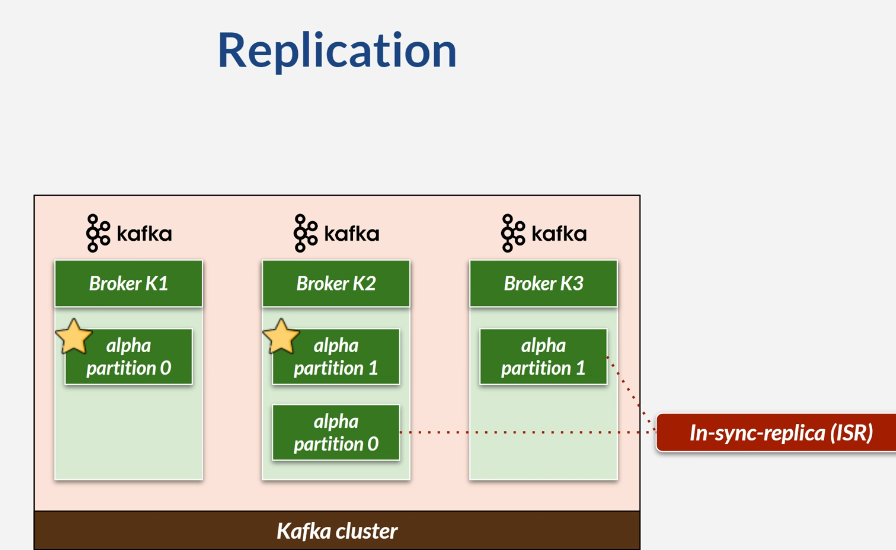
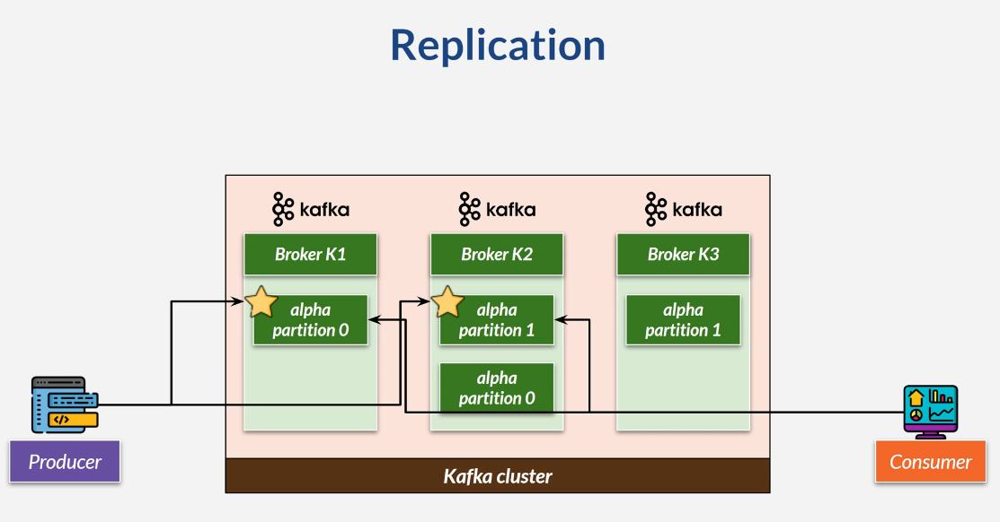
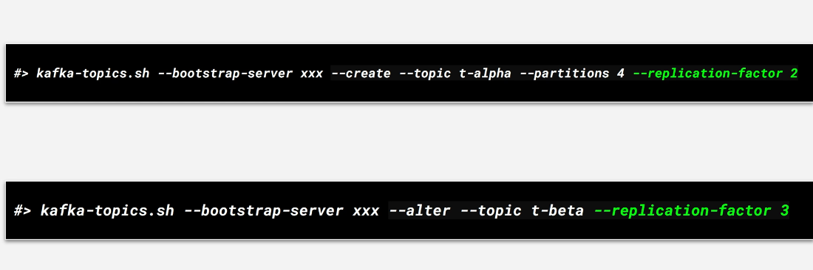
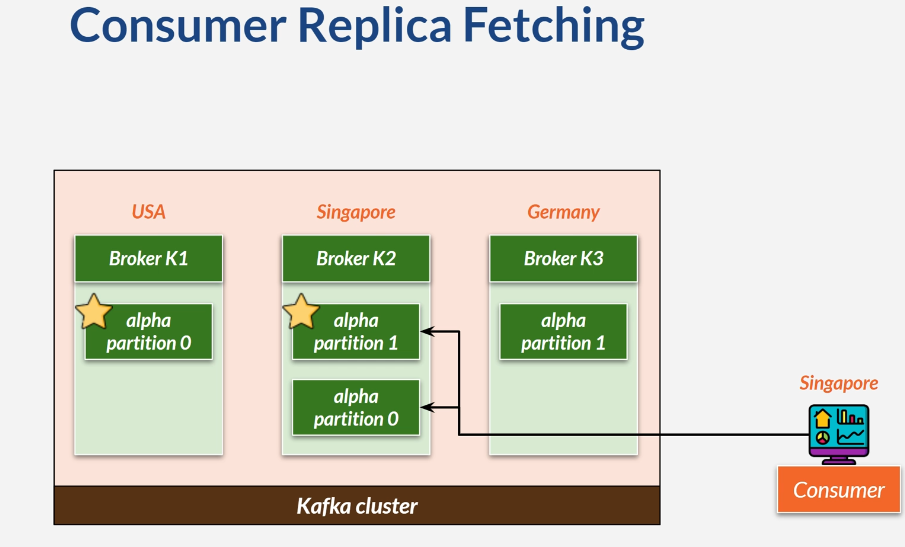

# Replication

* Copy data from one broker to another
* Data redundancy benefit
* Increase replication factor(2,3, ...)
* Data will be copied as much as a replication factor
* If a broker is down, other broker will still have the copy of data

## Set Replication Factor on Topic

## Consumer Replica Fetching

* Kafka 2.4 or newer
* Broker setting
    * rack.id = XYZ
    * replica.selector.class
* Consumer setting
    * client.rack = XYZ

